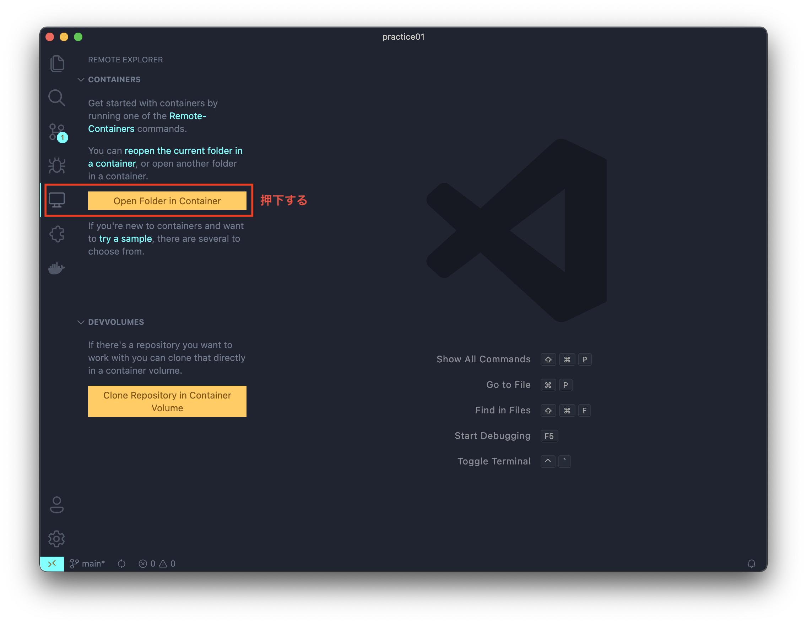
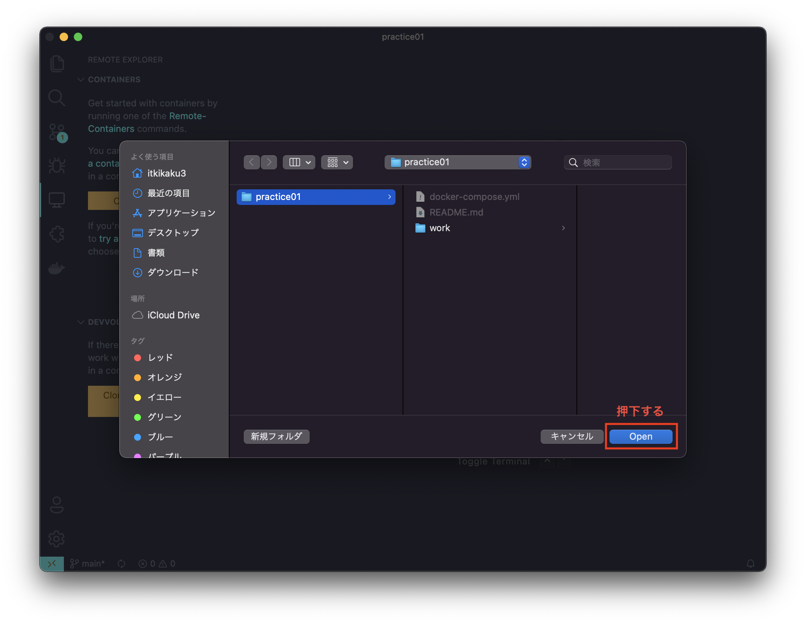
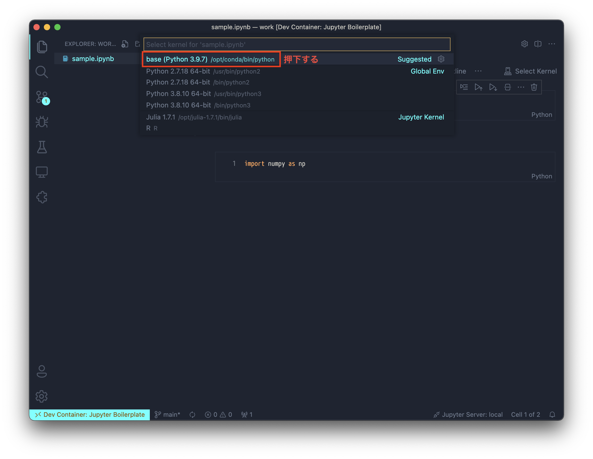

# Jupyter Boilerplate

## できること

Visual Studio CodeでJupyter Notebookを操作できるようになる。

## Get Started

作業フォルダを作りたいフォルダに移動して、リポジトリをクローンする。

``` shell
git clone https://github.com/kazukitash/jupyter-boilerplate.git practice01
```

フォルダを移動する。

``` shell
cd practice01
```

VS Codeを起動する。

``` shell
code .
```

`Remote - Containers`拡張機能が入っていない場合はインストールする。`Remote Explorer` タブの `Open Folder in Container` を押下する。





workフォルダで作業できる。PythonのKernelは`base (Python 3.9.7)`を選択すること。



### 前提

以下の導入が前提。[setup-macos](https://github.com/kazukitash/setup-macos)でインストール方法を説明しているので参照すること。

  - Visual Studio Code
  - Docker Desktop

## 利用しているDocker Image

  - [jupyter/datascience-notebook:python-3.9.7](https://hub.docker.com/layers/jupyter/datascience-notebook/python-3.9.7/images/sha256-928a689d2793ac3bb873549da112d82070e3ab4cda370ec68853e20d535bb7cc?context=explore)

## 追加しているVS Code Extensions

### Python, Jupyter用

  - ms-python.python
  - ms-toolsai.jupyter
  - ms-toolsai.jupyter-keymap
  - ms-toolsai.jupyter-renderers
  - ms-python.vscode-pylance

### CSV用

  - mechatroner.rainbow-csv

## 参考

- [Docker + VSCode + Remote Containerで作る快適Jupyter Lab(Python)分析環境](https://qiita.com/sho-hata/items/02ad47f67bce6816a69a)
- [【Docker】3分でjupyterLab(python)環境を作る！](https://qiita.com/hgaiji/items/edf71435d0565257f980)
